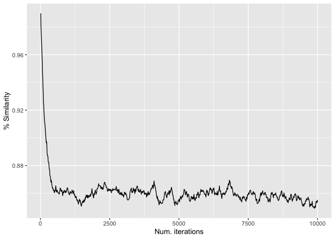
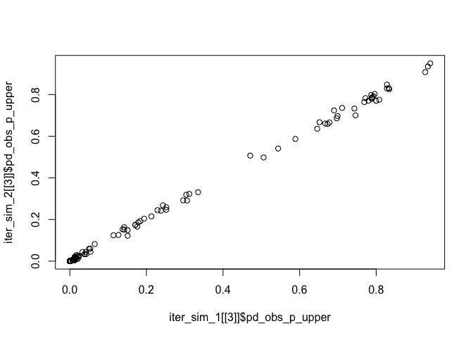

Spatial phylogenetics in R with canaper
================

This tutorial demonstrates how to use
[`canaper`](https://github.com/ropensci/canaper) to conduct spatial
phylogenetic analysis in R.

## Load data

Normally you would probably load data into R using a function like
`read.csv()` for community data and `ape::read.tree()` for the
phylogeny. However, `canaper` comes pre-loaded with some example data,
so we will use that for the tutorial. The data files are available after
you have loaded `canaper`. We will also load the `tidyverse` set of
packages for handling data and creating plots.

First, load packages.

``` r
library(canaper)
library(tidyverse)
```

Next, load data. We will use two example datasets for this tutorial,
`biod_example` and `acacia`. `biod_example` is a small example dataset
of made-up data for demonstration and testing purposes. `acacia` is a
real dataset of *Acacia* species in Australia (Mishler et al. 2014).

``` r
data(biod_example)
data(acacia)
```

Each dataset is a list including two items. The first, `phy`, is the
phylogeny:

``` r
biod_example$phy
```


    Phylogenetic tree with 31 tips and 30 internal nodes.

    Tip labels:
      sp19, sp5, sp15, sp1, sp10, sp26, ...
    Node labels:
      29___, 28___, 22___, 20___, 19___, 15___, ...

    Rooted; includes branch lengths.

``` r
acacia$phy
```


    Phylogenetic tree with 510 tips and 509 internal nodes.

    Tip labels:
      Pararchidendron_pruinosum, Paraserianthes_lophantha, adinophylla, semicircinalis, aphanoclada, inaequilatera, ...

    Rooted; includes branch lengths.

The second, `comm`, is a community dataframe with species as columns and
rows as sites. The row names (sites) correspond to grid-cell centroids.
For `biod_example` they are just made up; for `acacia` they are of 50 x
50 km grid cells covering Australia. The community matrix is too large
to print out in its entirety, so we will just take a look at the first 8
rows and columns[^1]:

``` r
dim(biod_example$comm)
```

    [1] 127  31

``` r
biod_example$comm[1:8, 1:8]
```

                    sp1 sp2 sp3 sp4 sp5 sp6 sp7 sp8
    1950000:1350000   0   0   0   0   0   0   0   0
    1950000:1450000   0   0   0   0   0   0   0   0
    2050000:1250000   0   0   0   0   0   0   0   0
    2050000:1350000   0   0   0   0   0   0   0   0
    2150000:1050000   0   0   0   0   0   0   0   0
    2150000:1150000   0   0   0   0   0   0   0   0
    2150000:1250000   0   0   0   0   0   0   0   0
    2250000:1050000   0   0   0   0   0   0   0   0

``` r
dim(acacia$comm)
```

    [1] 3037  508

``` r
acacia$comm[1:8, 1:8]
```

                      abbreviata acanthaster acanthoclada acinacea aciphylla acoma acradenia acrionastes
    -1025000:-1825000          0           0            0        0         0     0         0           0
    -1025000:-1875000          0           0            0        0         0     0         0           0
    -1025000:-1925000          0           0            0        0         0     0         0           0
    -1025000:-1975000          0           0            0        0         0     0         0           0
    -1025000:-2025000          0           0            0        0         0     0         0           0
    -1025000:-2075000          0           0            0        0         0     0         0           0
    -1025000:-2125000          0           0            0        0         0     0         0           0
    -1025000:-2225000          0           0            0        0         0     0         0           0

## About randomizations

As we learned in the workshop, randomizations are a key part of spatial
phylogenetics analysis that allow us to determine if the observed
phylogenetic structure is different from our null hypothesis.

The statistical expectation is largely **determined by the settings used
for the randomization**. So we must take great care to use a
randomization that makes **biological sense** for our study.

One kind of commonly used randomization algorithm (also sometimes
referred to as the “null model”) preserves marginal sums; in other
words, the total number of species in each site and total number of
occurrences of each species is unchanged, but the distribution of
species across sites is shuffled. Generally, when testing hypotheses we
only want to change one variable at a time, so it is probably good to
leave abundance untouched while manipulating distribution patterns. But
this might not always be the case depending on your study (you might
want to manipulate something else). So think about it!

Anyways, we will use a randomization algorithm called “curveball” that
preserves marginal sums while shuffling occurrences. The next step is to
determine settings to use.

`cpr_rand_test()` includes two settings, `n_reps` and `n_iterations`.
These sound similar but refer to two very different things.

`n_reps` is the number of random communities to simulate. For example,
if `n_reps` is 100, will we be comparing each observed value (e.g.,
phylogenetic diversity, `pd_obs`), with 100 random replicates of
`pd_obs`. If `n_reps` is too low, we will lack sufficiently statistical
power to detect patterns in the data.

`n_iterations` is only used by some randomization algorithms, the
“sequential” algorithms. Sequential algorithms randomize a community
matrix by exchanging values between existing cells (“swapping”). As you
might guess, the `swap` algorithm is a sequential algorithm. One such
swap is a single “iteration”. If the total number of iterations,
`n_iterations`, is too low, the randomized matrix won’t be sufficiently
randomized, and will still resemble the original matrix[^2].

If either `n_reps` or `n_iterations` are set too high, it will take
overly long to finish the calculations. So our goal is to set them
sufficiently high to achieve proper randomization, but not so high
`cpr_rand_test()` never finishes.

### Effect of `n_iterations`

`canaper` includes a function to help determine the appropriate number
of iterations, `cpr_iter_sim()`. It starts with the raw data, then
shuffles it up to a maximum number of times (`n_iterations`). Each time
it shuffles the community, it calculates the similarity between the
original data and the shuffled version. We expect to see the similarity
decrease with each iteration until further shuffling ceases to have an
effect. You can think of this like shuffling a deck of cards; after many
shuffles, further shuffling doesn’t make the deck any more different
from when you started.

If you have a large dataset, you may not need to inspect every
iteration. The `thin` value tells the function to save only once every
`thin` values (e.g., once every 100 iterations, etc.)

We will run `cpr_iter_sim()` on each dataset, starting with
`biodiverse_example`.

``` r
biod_iter_sim_res <- cpr_iter_sim(
  comm = biod_example$comm,
  null_model = "curveball",
  n_iterations = 10000,
  thin = 10
)

biod_iter_sim_res
```

    # A tibble: 1,000 × 2
       iteration similarity
           <int>      <dbl>
     1        10      0.992
     2        20      0.981
     3        30      0.975
     4        40      0.961
     5        50      0.956
     6        60      0.951
     7        70      0.947
     8        80      0.943
     9        90      0.934
    10       100      0.927
    # ℹ 990 more rows

The output is simple: just two columns. But its hard to gain much
insight from the raw numbers. Let’s plot them.

``` r
ggplot2::ggplot(biod_iter_sim_res, aes(x = iteration, y = similarity)) +
  geom_line() +
  labs(x = "Num. iterations", y = "% Similarity")
```



From this, we can see that the original community and the randomized
community reach a maximum dissimilarity at ca. 1,000 iterations. After
that, the randomized community doesn’t become any more different with
additional “mixing”.

How does this compare to the *Acacia* dataset? We will need to greatly
increase the number of iterations since the dataset is much larger.

``` r
acacia_iter_sim_res <- cpr_iter_sim(
  comm = acacia$comm,
  null_model = "curveball",
  n_iterations = 100000,
  thin = 1000
)

ggplot2::ggplot(acacia_iter_sim_res, aes(x = iteration, y = similarity)) +
  geom_line() +
  labs(x = "Num. iterations", y = "% Similarity")
```


We notice two important differences: the number of iterations required
is much higher (ca. 40,000), and the minimum % similarity is also
greater (ca. 96.5%).

That is because large matrices with many zeros take more iterations, and
even then still retain relatively high similarity between the original
matrix and the randomized matrix. So I recommend exploring the data as
above to determine the minimum number of iterations needed.

Now that we’ve settled on the number of iterations per random replicate,
let’s look into the number of replicates.

### Effect of `n_reps`

With randomizations, there is no “right” answer, so we can’t test to see
that `cpr_rand_test()` produces the exact answer we’re looking for.
Rather, we will check that it starts to **converge on approximately the
same result** once `n_reps` is high enough.

The code below compares the percentile of observed phylogenetic
diversity relative to random (`pd_obs_p_upper`, [one of the values used
for calculating endemism
type](https://docs.ropensci.org/canaper/articles/canape.html#classify-endemism))
between pairs of random communities each generated with the same number
of replicates[^3].

We are only running this on the `biod_example` data because the `acacia`
dataset would take too long to run during a workshop.

``` r
n_reps_test <- c(10, 100, 1000)

iter_sim_1 <- purrr::map(
  n_reps_test,
  ~cpr_rand_test(
    comm = biod_example$comm,
    phy = biod_example$phy,
    null_model = "curveball",
    n_iterations = 2000,
    n_reps = .x,
    tbl_out = TRUE)
  )

iter_sim_2 <- purrr::map(
  n_reps_test,
  ~cpr_rand_test(
    comm = biod_example$comm,
    phy = biod_example$phy,
    null_model = "curveball",
    n_iterations = 2000,
    n_reps = .x,
    tbl_out = TRUE)
  )

plot(iter_sim_1[[1]]$pd_obs_p_upper, iter_sim_2[[1]]$pd_obs_p_upper)
```


``` r
plot(iter_sim_1[[2]]$pd_obs_p_upper, iter_sim_2[[2]]$pd_obs_p_upper)
```


``` r
plot(iter_sim_1[[3]]$pd_obs_p_upper, iter_sim_2[[3]]$pd_obs_p_upper)
```



This gives us a visual confirmation that our results are much more
consistent when the number of reps has been set to at least 1,000.

The number of reps needed is somewhat less variable than number of
iterations across datasets. 1,000 is a good rule of thumb, but I still
recommend testing with an analysis like this one to be sure.

[^1]: You might think the dataset is all zeros, but that is not the
    case. It is just very sparse.

[^2]: A third argument, `thin`, only applies to a small number of
    algorithms; for details, see `vegan::commsim()`

[^3]: Other values based on the randomizations could be checked too
    (e.g., values ending in `_obs_z`, `_rand_mean`, or `_rand_sd`).
