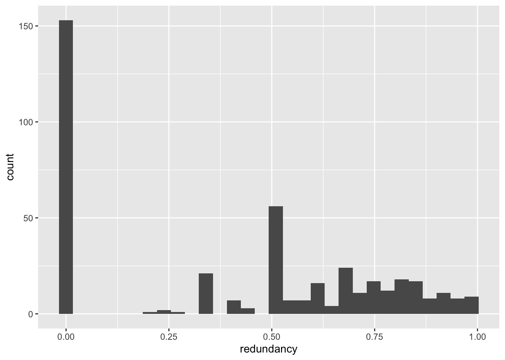
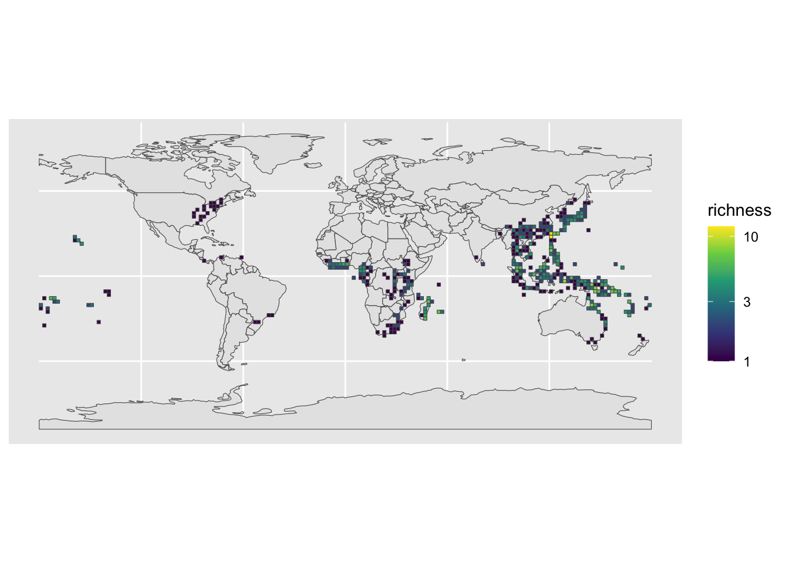
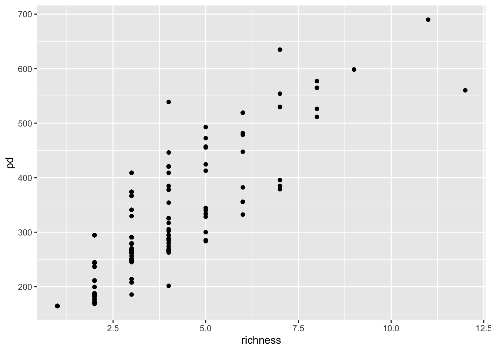

# Obtaining occurrence and phylogeny data in R

This tutorial demonstrates how to obtain occurrence records and
phylogenies to use for spatial phylogenetics in R. As an example, we
will obtain occurrence records and a phylogeny for the fern genus
*Crepidomanes*.

## Setup

Install the following R packages:

```r
install.packages(
  c(
    "rgbif",
    "tidyverse",
    "rnaturalearth",
    "CoordinateCleaner",
    "sf",
    "phyloregion",
    "remotes"
  )
)
```

`naturalearthhires` and `ftolr` are also needed, but you must use a different command to install them:

```r
remotes::install_github("ropensci/rnaturalearthhires")
remotes::install_github("fernphy/ftolr")
```

## Obtaining occurrence data with rgbif

[GBIF](https://www.gbif.org/) is the largest platform for accessing
biodiveristy data[^1], making it an excellent source of occurrence data
for spatial phylogenetics.

[`rgbif`](https://docs.ropensci.org/rgbif/) is an R package that
interfaces with the GBIF [API](https://en.wikipedia.org/wiki/API),
allowing you to query and download GBIF data from R.

### Quick searches

`occ_search()` is a quick way to get GBIF data into R (and does not
require logging in), but is limited to 100,000 records per query.

``` r
library(rgbif)
library(tidyverse)

# Query for the fern genus Crepidomanes
crep_records <- occ_search(scientificName = "Crepidomanes")

# Data are stored in 'data'
crep_records$data[1:6, 1:6]
```

    # A tibble: 6 × 6
      key        scientificName   decimalLatitude decimalLongitude issues datasetKey
      <chr>      <chr>                      <dbl>            <dbl> <chr>  <chr>     
    1 4011676253 Crepidomanes mi…            25.0            122.  cdc,c… 50c9509d-…
    2 4015019122 Crepidomanes mi…            23.9            122.  cdc,c… 50c9509d-…
    3 4046492607 Crepidomanes in…            39.5            -82.6 cdc,c… 50c9509d-…
    4 4018578880 Crepidomanes la…            24.1            121.  cdc    50c9509d-…
    5 4018244292 Crepidomanes mi…            23.3            121.  cdc,c… 50c9509d-…
    6 4018594500 Crepidomanes mi…            23.3            121.  cdc,c… 50c9509d-…

``` r
# There are a *lot* of columns: 162!
dim(crep_records$data)
```

    [1] 500 160

### Store login credentials for bigger searches

**IMPORTANT NOTE**: Only do this if you are using your own computer!
**[Skip this step](#downloading-a-complete-dataset) if you are running
the code in the cloud**, i.e., [in a
binder](https://mybinder.readthedocs.io/en/latest/about/user-guidelines.html#how-secure-is-mybinder-org).
In that case, enter your credentials directly into the `occ_download()`
function.

To do anything beyond simple queries with rgbif, you will need a GBIF
account.

If you don’t have one yet, create it now by going to
<https://www.gbif.org>, clicking on “Login” in the upper-right, then
clicking on “Register”.

To make authentication easier, we will store login credentials in a
special file called `.Renviron` outside of your project using the
`usethis` package.

``` r
usethis::edit_r_environ("user")
```

This will open the `.Renviron` file in your editor.

Fill in your credentials like this (replacing the dummy values like
‘myname’ with you real data):

    GBIF_USER=myname
    GBIF_PWD=secretpassword
    GBIF_EMAIL=me@myemail.com

Save it and restart R. Now you will be able to use `rgbif` download
functionality without having to enter your login credentials every time.

### Downloading a complete dataset

To download a complete dataset, use `occ_download()`. This requires you
provide login credentials. If you set them up using the `.Renviron` file
[as described above](#store-login-credentials-for-bigger-searches), you
won’t have to type them in. Otherwise, you can enter them directly into
the `occ_download()` function using the arguments `user`, `pwd`, and
`email` (NEVER save these directly to an R file that could become
public!).

I assume that you are working in a project folder than includes a
subdirectory called “data_raw”. If not, set this up now.

``` r
# First we need to look up the species key for Crepidomanes
crep_key <- name_backbone("Crepidomanes")$genusKey

# Send download request
gbif_download <- occ_download(
  pred("taxonKey", crep_key),
  format = "SIMPLE_CSV")

# Wait for the request to be completed (should take 2-3 minutes)
occ_download_wait(gbif_download, curlopts = list(http_version=2))

# Download the data
crep_records_path <- occ_download_get(gbif_download, "data_raw")

# Load the data into R
crep_records_raw <- occ_download_import(crep_records_path)
```

    Download file size: 1.44 MB

    On disk at /Users/joelnitta/repos/spatial-phy-workshop/tutorials/0010097-230530130749713.zip

Note that the output of `occ_download()` includes a DOI for this
dataset:

``` r
gbif_download
```

    <<gbif download>>
      Your download is being processed by GBIF:
      https://www.gbif.org/occurrence/download/0010097-230530130749713
      Most downloads finish within 15 min.
      Check status with
      occ_download_wait('0010097-230530130749713')
      After it finishes, use
      d <- occ_download_get('0010097-230530130749713') %>%
        occ_download_import()
      to retrieve your download.
    Download Info:
      Username: joelnitta
      E-mail: joelnitta@gmail.com
      Format: SIMPLE_CSV
      Download key: 0010097-230530130749713
      Created: 2023-06-05T07:38:28.125+00:00
    Citation Info:  
      Please always cite the download DOI when using this data.
      https://www.gbif.org/citation-guidelines
      DOI: 10.15468/dl.efajva
      Citation:
      GBIF Occurrence Download https://doi.org/10.15468/dl.efajva Accessed from R via rgbif (https://github.com/ropensci/rgbif) on 2023-06-05

You should visit the DOI to see what your raw dataset looks like in
GBIF: <https://doi.org/10.15468/dl.efajva>.

You should always **be sure to cite the DOI if you publish your study**.
If you filter the data, you may need to cite a “derived” dataset. For
more information, see [this documentation from
rOpenSci](https://docs.ropensci.org/rgbif/articles/gbif_citations.html).

[GBIF has a
policy](https://www.gbif.org/faq?question=for-how-long-will-does-gbif-store-downloads)
of retaining datasets registered with a DOI for 6 months initially, and
as long as possible once published.

### Inspect the dataset

Let’s take a look at the dataset.

``` r
crep_records_raw
```

    # A tibble: 20,299 × 50
          gbifID datasetKey     occurrenceID kingdom phylum class order family genus
     *   <int64> <chr>          <chr>        <chr>   <chr>  <chr> <chr> <chr>  <chr>
     1 991749096 bf2a4bf0-5f31… http://data… Plantae Trach… Poly… Hyme… Hymen… Crep…
     2 991749040 bf2a4bf0-5f31… http://data… Plantae Trach… Poly… Hyme… Hymen… Crep…
     3 991748916 bf2a4bf0-5f31… http://data… Plantae Trach… Poly… Hyme… Hymen… Crep…
     4 991748915 bf2a4bf0-5f31… http://data… Plantae Trach… Poly… Hyme… Hymen… Crep…
     5 991748307 bf2a4bf0-5f31… http://data… Plantae Trach… Poly… Hyme… Hymen… Crep…
     6 991747993 bf2a4bf0-5f31… http://data… Plantae Trach… Poly… Hyme… Hymen… Crep…
     7 991747797 bf2a4bf0-5f31… http://data… Plantae Trach… Poly… Hyme… Hymen… Crep…
     8 991747708 bf2a4bf0-5f31… http://data… Plantae Trach… Poly… Hyme… Hymen… Crep…
     9 991747526 bf2a4bf0-5f31… http://data… Plantae Trach… Poly… Hyme… Hymen… Crep…
    10 991747268 bf2a4bf0-5f31… http://data… Plantae Trach… Poly… Hyme… Hymen… Crep…
    # ℹ 20,289 more rows
    # ℹ 41 more variables: species <chr>, infraspecificEpithet <chr>,
    #   taxonRank <chr>, scientificName <chr>, verbatimScientificName <chr>,
    #   verbatimScientificNameAuthorship <chr>, countryCode <chr>, locality <chr>,
    #   stateProvince <chr>, occurrenceStatus <chr>, individualCount <int>,
    #   publishingOrgKey <chr>, decimalLatitude <dbl>, decimalLongitude <dbl>,
    #   coordinateUncertaintyInMeters <dbl>, coordinatePrecision <dbl>, …

The dataset is so large it is difficult to print out to the screen. This
output type (`"SIMPLE_CSV"`) includes 50 columns, which is less than
when we used `occ_search()`, but it’s still a lot.

The `dplyr::glimpse()` function is useful when there are lots of columns
to get an idea of what each column holds.

``` r
glimpse(crep_records_raw[1, ])
```

    Rows: 1
    Columns: 50
    $ gbifID                           <int64> 991749096
    $ datasetKey                       <chr> "bf2a4bf0-5f31-11de-b67e-b8a03c50a862"
    $ occurrenceID                     <chr> "http://data.rbge.org.uk/herb/E0068…
    $ kingdom                          <chr> "Plantae"
    $ phylum                           <chr> "Tracheophyta"
    $ class                            <chr> "Polypodiopsida"
    $ order                            <chr> "Hymenophyllales"
    $ family                           <chr> "Hymenophyllaceae"
    $ genus                            <chr> "Crepidomanes"
    $ species                          <chr> "Crepidomanes latealatum"
    $ infraspecificEpithet             <chr> ""
    $ taxonRank                        <chr> "SPECIES"
    $ scientificName                   <chr> "Crepidomanes latealatum (Bosch) Cope…
    $ verbatimScientificName           <chr> "Crepidomanes late-alatum (v.d.B.) Co…
    $ verbatimScientificNameAuthorship <chr> ""
    $ countryCode                      <chr> "TH"
    $ locality                         <chr> "Doi Sutep-Doi Pui National Park. San…
    $ stateProvince                    <chr> "Chiang Mai"
    $ occurrenceStatus                 <chr> "PRESENT"
    $ individualCount                  <int> NA
    $ publishingOrgKey                 <chr> "98e934b0-5f31-11de-b67e-b8a03c50a862"
    $ decimalLatitude                  <dbl> 18.8
    $ decimalLongitude                 <dbl> 98.91667
    $ coordinateUncertaintyInMeters    <dbl> NA
    $ coordinatePrecision              <dbl> NA
    $ elevation                        <dbl> 1030
    $ elevationAccuracy                <dbl> 0
    $ depth                            <dbl> NA
    $ depthAccuracy                    <lgl> NA
    $ eventDate                        <dttm> 2008-09-17
    $ day                              <int> 17
    $ month                            <int> 9
    $ year                             <int> 2008
    $ taxonKey                         <int> 3608450
    $ speciesKey                       <int> 3608450
    $ basisOfRecord                    <chr> "PRESERVED_SPECIMEN"
    $ institutionCode                  <chr> "E"
    $ collectionCode                   <chr> "E"
    $ catalogNumber                    <chr> "E00688142"
    $ recordNumber                     <chr> "4478"
    $ identifiedBy                     <chr> ""
    $ dateIdentified                   <dttm> NA
    $ license                          <chr> "CC_BY_NC_4_0"
    $ rightsHolder                     <chr> ""
    $ recordedBy                       <chr> "Middleton, David J.; Karaket, P.; Tr…
    $ typeStatus                       <chr> ""
    $ establishmentMeans               <chr> ""
    $ lastInterpreted                  <dttm> 2023-05-29 16:49:31
    $ mediaType                        <chr> ""
    $ issue                            <chr> "GEODETIC_DATUM_ASSUMED_WGS84;CONTINE…

That’s better.

There are number of columns that bear mentioning[^2].

- `datasetKey` is a unique identifier for the dataset that the
  occurrence record belongs to. You will want to cite this for each
  occurrence record you use.
- `species` is the Latin binomial.
- `scientificName` is the scientific name including the taxonomic
  authority. This is the official name used by GBIF (the “GBIF backbone
  taxonomy”).
- `verbatimScientificName` is the scientific name that was originally
  associated with this record.
- `decimalLatitude` is the latitude in decimal-degrees.
- `decimalLongitude` is the longitude in decimal-degrees.
- `basisOfRecord` describes what kind of occurrence record this is (more
  on that below).
- `issue` lists any possible data-quality issues associated with this
  record.

What is the deal with `basisOfRecord`? Let’s see what values are
included in this dataset:

``` r
crep_records_raw %>%
  count(basisOfRecord)
```

    # A tibble: 8 × 2
      basisOfRecord           n
      <chr>               <int>
    1 HUMAN_OBSERVATION     721
    2 LIVING_SPECIMEN         4
    3 MACHINE_OBSERVATION     6
    4 MATERIAL_CITATION       5
    5 MATERIAL_SAMPLE       199
    6 OBSERVATION             1
    7 OCCURRENCE            389
    8 PRESERVED_SPECIMEN  18974

We see that the majority of these are `PRESERVED_SPECIMEN`; in the case
of plants, those are almost certainly herbarium specimens. You can treat
such occurrence records as high-quality because they have a voucher
specimen to back them up; if you really wanted to, you could
theoretically track down the specimen for any of these occurrence
records and inspect it.

The next most common is `HUMAN_OBSERVATION`. This means that this
species was recorded as being in a particular place, but there is no
voucher specimen for it. Most of these types of records come from
[iNaturalist](https://www.inaturalist.org/). These should be treated as
less reliable than `PRESERVED_SPECIMEN` since we can’t verify them.
However, only iNaturalist records that have been certified as “Research
Grade”[^3] are included in GBIF, so that does offer some assurance of
quality.

Another common type of `basisOfRecord` that comes up is
`FOSSIL_SPECIMEN`, which are fossils as the name suggests. If you are
only interested in extant organisms you probably want to exclude these.
The complete list of possible values is at
<https://gbif.github.io/parsers/apidocs/org/gbif/api/vocabulary/BasisOfRecord.html>.

Let’s see how many species there for each type of `basisOfRecord`:

``` r
crep_records_raw %>%
  group_by(basisOfRecord) %>%
  summarize(
    n_sp = n_distinct(species)
  )
```

    # A tibble: 8 × 2
      basisOfRecord        n_sp
      <chr>               <int>
    1 HUMAN_OBSERVATION      27
    2 LIVING_SPECIMEN         3
    3 MACHINE_OBSERVATION     1
    4 MATERIAL_CITATION       1
    5 MATERIAL_SAMPLE        28
    6 OBSERVATION             1
    7 OCCURRENCE             25
    8 PRESERVED_SPECIMEN     56

Most of them are preserved specimens, as expected.

How many species are only represented by `HUMAN_OBSERVATION` records? In
other words, if we were to drop all `HUMAN_OBSERVATION` records, how
many species would we lose?

``` r
crep_records_raw %>%
  group_by(species) %>%
  add_count(basisOfRecord) %>%
  filter(basisOfRecord == "HUMAN_OBSERVATION", n == 1) %>%
  count(species)
```

    # A tibble: 6 × 2
    # Groups:   species [6]
      species                      n
      <chr>                    <int>
    1 Crepidomanes christii        1
    2 Crepidomanes liukiuense      1
    3 Crepidomanes makinoi         1
    4 Crepidomanes parvifolium     1
    5 Crepidomanes rupicola        1
    6 Crepidomanes walleri         1

For now we will leave them in, but these are the sorts of things you
need to consider when working with data from GBIF.

## Cleaning spatial data with CoordinateCleaner

As mentioned in the lecture this morning, we cannot treat GBIF data at
face-value; unfortunately errors may creep into the data on GBIF. These
may include typos, arbitrary data points such as country centroids used
when actual GPS points are lacking, etc. We don’t want to include
erroneous data points in our analysis, so we need to clean the data.

### Visualize the raw data

Before we clean the raw data, let’s visualize it (always a good idea,
regardless of what kind of data you are working with). Here we will use
the `ggplot2` package included in `tidyverse`.

``` r
# Download world map data
library(rnaturalearth)

world_map <- ne_countries(returnclass = "sf")

ggplot()+
  geom_sf(data = world_map) +
  geom_point(
    data = crep_records_raw,
    aes(x = decimalLongitude, y = decimalLatitude, color = species),
    size = 0.5) +
  theme(legend.position = "none")
```

    Warning: Removed 10493 rows containing missing values (`geom_point()`).


There are too many colors to distinguish all the species so I’m not
showing their names, but its still interesting to see their overall
distribution patterns.

Looking at this map, are there any points that you think might be
errors?

### Remove missing values

Did you notice the warning message when we ran `ggplot()`? It said 10493
rows containing missing values had been removed rom the plot. Clearly we
can’t use data that lack GPS points! The first step of cleaning the data
is to remove these values.

``` r
crep_records_no_missing <-
  crep_records_raw %>%
  # Also remove data that are missing species names
  mutate(species = na_if(species, "")) %>%
  filter(
    !is.na(species),
    !is.na(decimalLongitude),
    !is.na(decimalLatitude)
  )

crep_records_no_missing
```

    # A tibble: 9,572 × 50
          gbifID datasetKey     occurrenceID kingdom phylum class order family genus
         <int64> <chr>          <chr>        <chr>   <chr>  <chr> <chr> <chr>  <chr>
     1 991749096 bf2a4bf0-5f31… http://data… Plantae Trach… Poly… Hyme… Hymen… Crep…
     2 991749040 bf2a4bf0-5f31… http://data… Plantae Trach… Poly… Hyme… Hymen… Crep…
     3 991748916 bf2a4bf0-5f31… http://data… Plantae Trach… Poly… Hyme… Hymen… Crep…
     4 991748915 bf2a4bf0-5f31… http://data… Plantae Trach… Poly… Hyme… Hymen… Crep…
     5 991748307 bf2a4bf0-5f31… http://data… Plantae Trach… Poly… Hyme… Hymen… Crep…
     6 991747797 bf2a4bf0-5f31… http://data… Plantae Trach… Poly… Hyme… Hymen… Crep…
     7 991747708 bf2a4bf0-5f31… http://data… Plantae Trach… Poly… Hyme… Hymen… Crep…
     8 991747526 bf2a4bf0-5f31… http://data… Plantae Trach… Poly… Hyme… Hymen… Crep…
     9 991747268 bf2a4bf0-5f31… http://data… Plantae Trach… Poly… Hyme… Hymen… Crep…
    10 991746718 bf2a4bf0-5f31… http://data… Plantae Trach… Poly… Hyme… Hymen… Crep…
    # ℹ 9,562 more rows
    # ℹ 41 more variables: species <chr>, infraspecificEpithet <chr>,
    #   taxonRank <chr>, scientificName <chr>, verbatimScientificName <chr>,
    #   verbatimScientificNameAuthorship <chr>, countryCode <chr>, locality <chr>,
    #   stateProvince <chr>, occurrenceStatus <chr>, individualCount <int>,
    #   publishingOrgKey <chr>, decimalLatitude <dbl>, decimalLongitude <dbl>,
    #   coordinateUncertaintyInMeters <dbl>, coordinatePrecision <dbl>, …

That alone decreased our number of records by nearly half.

### Example CoordinateCleaner cleaning function: `cc_sea()`

So we have removed obviously unusable data points. Great! But we need to
be careful that there may still be erroneous data lurking. For example,
records of terrestrial plants that show up in the ocean, country
centroids used instead of actual GPS points, etc. Fortunately, the
`CoordinateCleaner` R package can detect these for us.

To demonstrate how this works, let’s start with an example: data points
in the ocean. Our study species is a terrestrial fern, so if any
occurrence records show up in the middle of the ocean, they should be
removed.

Here, “scale” tells `CoordinateCleaner` to use the most detailed scale
possible, `10` (you could choose `50` or `110` also, but these are
progressively lower resolution[^4]).

``` r
library(CoordinateCleaner)
```

    rgeos version: 0.6-3, (SVN revision 696)
     GEOS runtime version: 3.11.0-CAPI-1.17.0 
     Please note that rgeos will be retired during October 2023,
    plan transition to sf or terra functions using GEOS at your earliest convenience.
    See https://r-spatial.org/r/2023/05/15/evolution4.html for details.
     GEOS using OverlayNG
     Linking to sp version: 1.6-0 
     Polygon checking: TRUE 

``` r
crep_records_sea_flagged <- 
  cc_sea(
    crep_records_no_missing,
    lon = "decimalLongitude",
    lat = "decimalLatitude",
    scale = 10,
    value = "flagged"
  )
```

    Testing sea coordinates

    Flagged 571 records.

The output here is a logical vector of occurrence records that passed
the test: `TRUE` are those that passed, and `FALSE` are those that
failed.

``` r
head(crep_records_sea_flagged)
```

    [1] TRUE TRUE TRUE TRUE TRUE TRUE

However, we should not accept the results of `CoordinateCleaner`
blindly. Let’s dig in to these in a bit more detail.

First, filter the original records to only those that got flagged as
being in the ocean:

``` r
crep_records_sea <-
  crep_records_no_missing %>%
  filter(!crep_records_sea_flagged)
```

We’d like to plot these, but there are too many to look at them in
detail on a global scale. Instead, let’s see what country had the most
and then zoom in there.

``` r
count(crep_records_sea, countryCode, sort = TRUE)
```

    # A tibble: 30 × 2
       countryCode     n
       <chr>       <int>
     1 JP            222
     2 PG             53
     3 TW             40
     4 AU             38
     5 ID             36
     6 PH             20
     7 US             18
     8 ZA             14
     9 PF             12
    10 CK             10
    # ℹ 20 more rows

It looks like Japan (`JP`) had by far the most. OK, let’s plot those.

``` r
# Load package needed for hi-res maps
library(rnaturalearthhires)

# Filter flagged records to just Japan
crep_records_sea_jp <- 
  crep_records_sea %>%
  filter(countryCode == "JP")

# Download map data for Japan
japan <- rnaturalearth::ne_countries(country = "japan", scale = 10, returnclass = "sf")

# Plot the flagged points
ggplot() +
  geom_sf(data = japan) +
  geom_point(
    data = crep_records_sea_jp,
    mapping = aes(x = decimalLongitude, y = decimalLatitude),
    color = "red"
  )
```


See a pattern? All (or at least the vast majority) of points that got
flagged occur along coastlines or nearby small islands. So these are
probably perfectly useable points, but they are close enough to the
coast that they got mistakenly flagged. That is because the default
`CoordinateCleaner` maps of coastlines expect very high accuracy of the
GPS points. However, there is an alternate setting, a map with buffers
around the coasts called “buffland”. Load it with `data("buffland")`.

``` r
data("buffland")
```

This is what it looks like when we plot it. Any points **outside** the
grey area will be flagged as being in the ocean.

``` r
# We need to load the sf package for this (more on that in a bit)
library(sf)
```

    Linking to GEOS 3.11.0, GDAL 3.5.3, PROJ 9.1.0; sf_use_s2() is TRUE

``` r
ggplot(st_as_sf(buffland)) +
  geom_sf(fill = "grey70")
```


As you can see, by using this map as a cutoff, we be sure that we are
only excluding points in the open ocean, far from any coasts. Let’s try
that.

``` r
crep_records_sea_flagged_buff <- 
  cc_sea(
    crep_records_no_missing,
    lon = "decimalLongitude",
    lat = "decimalLatitude",
    ref = buffland,
    value = "flagged"
  )
```

    Testing sea coordinates

    Warning in reproj(ref): no projection information for reference found, 
                assuming '+proj=longlat +datum=WGS84 +no_defs'

    Flagged 5 records.

Many fewer records were flagged this time.

We can plot them:

``` r
crep_records_sea_buff <-
  crep_records_no_missing %>%
     filter(crep_records_sea_flagged_buff == FALSE)

ggplot() +
  geom_sf(data = world_map) +
  geom_point(
    data = crep_records_sea_buff,
    mapping = aes(x = decimalLongitude, y = decimalLatitude),
    color = "red"
  )
```


This looks better, but you may want to zoom in to individual points, for
example by querying their latitude and longitude on Google Maps.

### Full CoordinateCleaner cleaning function: `clean_coordinates()`

There are many functions starting with `cc_` that do other checks, such
as `cc_dupl()` that checks for duplicates, `cc_urb()` that checks for
species in urban areas, etc. You could pass your data through these
individually. However, there is also a single function that can run them
all at once, `clean_coordinates()`. The `tests` argument tells it which
tests to conduct. Note that there is a long list of settings for the
various tests. Here we are using mostly default settings, but **you
should always check to make sure the settings make sense for your
data**.

``` r
crep_records_flagged <-
  clean_coordinates(
    crep_records_no_missing,
    lon = "decimalLongitude",
    lat = "decimalLatitude",
    species = "scientificName",
    tests = c(
      "capitals",     # records within 2km around country and province centroids
      "centroids",    # records within 1km of capitals centroids
      "duplicates",   # duplicated records
      "equal",        # records with equal coordinates
      "gbif",         # records within 1 degree (~111km) of GBIF headquarters
      "institutions", # records within 100m of zoo and herbaria
      "outliers",     # outliers
      "zeros",        # records with coordinates 0,0
      "urban",        # records within urban areas
      "seas"          # records in the ocean
    ),
    seas_ref = buffland,
    country_refcol = "countryCode",
    value = "spatialvalid" # result of tests are appended in separate columns
  )
```

    Testing coordinate validity

    Flagged 0 records.

    Testing equal lat/lon

    Flagged 65 records.

    Testing zero coordinates

    Warning: GEOS support is provided by the sf and terra packages among others

    Flagged 63 records.

    Testing country capitals

    Flagged 157 records.

    Testing country centroids

    Flagged 188 records.

    Testing sea coordinates

    Warning in reproj(ref): no projection information for reference found, 
                assuming '+proj=longlat +datum=WGS84 +no_defs'

    Flagged 5 records.

    Testing urban areas

    Downloading urban areas via rnaturalearth

    Flagged 910 records.

    Testing geographic outliers

    Warning in cc_outl(otl_test, lon = lon, lat = lat, species = species, method =
    outliers_method, : Species with fewer than 7 unique records will not be tested.

    Flagged 579 records.

    Testing GBIF headquarters, flagging records around Copenhagen

    Flagged 0 records.

    Testing biodiversity institutions

    Flagged 1 records.

    Testing duplicates

    Flagged 2596 records.

    Flagged 3664 of 9572 records, EQ = 0.38.

The output is our original dataframe with one column added for each
test, as well as an overall column called `.summary`.

Let’s get a summary of the results.

``` r
summary(crep_records_flagged)
```

        .val     .equ     .zer     .cap     .cen     .sea     .urb     .otl 
           0       65       63      157      188        5      910      413 
        .gbf    .inst     .dpl .summary 
           0        1     2596     3664 

Unfortunately the output is a bit cryptic because `CoordinateCleaner`
uses very short abbreviations for column names, but we can see that
duplicates (`.dpl`) account for the largest share of flagged records.
This is because GBIF is an **aggregator** of databases, so it is quite
possible that the same specimen shows up multiple times. Good thing we
spotted these!

Let’s plot the cleaned and flagged data together:

``` r
ggplot() +
  geom_sf(data = world_map) +
  geom_point(
    data = crep_records_flagged,
    mapping = aes(x = decimalLongitude, y = decimalLatitude, color = .summary)
  )
```


Finally, let’s trim the occurrence records down to just the clean data
points.

``` r
crep_records_clean <-
  crep_records_flagged %>%
  filter(.summary == TRUE) %>%
  select(-contains(".")) %>%
  as_tibble()
```

## Obtaining a phylogeny

As mentioned in the lecture, there are various sources of phylogenies,
but unfortunately no “one size fits all” solution.

Since this example is for ferns, we will download a fern phylogeny that
is conveniently available via the `ftolr` package.

It isn’t on CRAN, so you need to use a slightly different command to
install it:

``` r
install.packages(
  "ftolr",
  repos = c(
    "https://joelnitta.r-universe.dev/",
    "https://cran.rstudio.com/"
  ),
  dep = TRUE)
```

Once it’s installed, we can obtain the tree with the `ft_tree()`
function.

``` r
library(ftolr)

fern_tree <- ft_tree()

fern_tree
```


    Phylogenetic tree with 5703 tips and 5702 internal nodes.

    Tip labels:
      Acrostichum_danaeifolium, Acrostichum_speciosum, Acrostichum_aureum, Ceratopteris_richardii, Ceratopteris_cornuta, Ceratopteris_pteridoides, ...
    Node labels:
      99/100, 100/100, 100, 100/100, 100/100, 100/100, ...

    Rooted; includes branch lengths.

## Matching names

There’s not much to say about the phylogeny, since that will be highly
particular to your study.

But a much more frequently encountered problem is matching names between
the phylogeny and the grid-cell data. How can we do that?

First let’s see how many species are in common between the two to begin
with. Notice that the tree uses underscores in the species names, so we
need to account for that.

``` r
common_species <- intersect(fern_tree$tip.label, str_replace_all(crep_records_clean$species, " ", "_"))
length(common_species)
```

    [1] 30

``` r
n_distinct(crep_records_clean$species)
```

    [1] 49

Of the 49 species in the cleaned occurrence data, 30 are in the tree.

Are the missing species truly missing, or are they just differences in
taxonomy (different synonyms)?

The names from the GBIF data are already standardized to the GBIF
taxonomy.

However, the names in the tree may not conform to the GBIF taxonomy. We
can query the names in the tree against the GBIF taxonomy using the
`name_backbone_checklist()` function of the `rgbif` package.

The first step is to format the query. `rgbif` expects this to be in the
form of a dataframe. Since we are only interested in ferns, we will set
the `class` column to “Polypodiopsida”. You could similarly set other
taxonomic ranks like `phylum`, `order`, `family`, etc.

``` r
# Set up query
names_query <- tibble(
  name = str_replace_all(fern_tree$tip.label, "_", " "),
  class = "Polypodiopsida"
)
```

Next, run the query using `name_backbone_checklist()`. This may take a
few minutes. Note that it is actually preferrable to query full
scientific names with authors, but we are skipping that because of time
restrictions.

``` r
fern_tree_names_lookup <- name_backbone_checklist(names_query)
dim(fern_tree_names_lookup)
```

    [1] 5703   26

As so often, the results are a large dataframe. Let’s just peak at the
first row to see what’s going on.

``` r
fern_tree_names_lookup %>%
  slice(1) %>%
  glimpse()
```

    Rows: 1
    Columns: 26
    $ usageKey         <int> 2651707
    $ scientificName   <chr> "Acrostichum danaeifolium Langsd. & Fisch."
    $ canonicalName    <chr> "Acrostichum danaeifolium"
    $ rank             <chr> "SPECIES"
    $ status           <chr> "ACCEPTED"
    $ confidence       <int> 100
    $ matchType        <chr> "EXACT"
    $ kingdom          <chr> "Plantae"
    $ phylum           <chr> "Tracheophyta"
    $ order            <chr> "Polypodiales"
    $ family           <chr> "Pteridaceae"
    $ genus            <chr> "Acrostichum"
    $ species          <chr> "Acrostichum danaeifolium"
    $ kingdomKey       <int> 6
    $ phylumKey        <int> 7707728
    $ classKey         <int> 7228684
    $ orderKey         <int> 392
    $ familyKey        <int> 2367
    $ genusKey         <int> 2650221
    $ speciesKey       <int> 2651707
    $ synonym          <lgl> FALSE
    $ class            <chr> "Polypodiopsida"
    $ acceptedUsageKey <int> NA
    $ verbatim_name    <chr> "Acrostichum danaeifolium"
    $ verbatim_class   <chr> "Polypodiopsida"
    $ verbatim_index   <dbl> 1

Important columns to note are `verbatim_name` with the original query
name and `species` with the accepted binomial in GBIF.

Some other interesting columns are `status` and `matchType`. Let’s see
what kind of values those include:

``` r
fern_tree_names_lookup %>% count(status)
```

    # A tibble: 3 × 2
      status       n
      <chr>    <int>
    1 ACCEPTED  5605
    2 DOUBTFUL     4
    3 SYNONYM     94

`status` includes `ACCEPTED`, `DOUBTFUL`, and `SYNONYM`. `ACCEPTED` is
names that are the same between the query and reference (GBIF).
`SYNONYM` are names in the query that are treated as synonyms by GBIF.
These are what we are trying to fix. `DOUBTFUL` are names that GBIF
thinks may be invalid.

``` r
fern_tree_names_lookup %>% count(matchType)
```

    # A tibble: 3 × 2
      matchType      n
      <chr>      <int>
    1 EXACT       5661
    2 FUZZY         23
    3 HIGHERRANK    19

`matchType` includes `EXACT`, `FUZZY`, and `HIGHERRANK`. `EXACT` are
names that could be looked up exactly as they are. `FUZZY` means that
the query differed slightly from the match, but the matching algorithm
considered them close enough to be recognized as the same. (We’ll look
into `HIGHERRANK` in a moment).

Let’s see an example of a fuzzy match:

``` r
fern_tree_names_lookup %>%
  filter(matchType == "FUZZY") %>%
  slice(1) %>%
  glimpse()
```

    Rows: 1
    Columns: 26
    $ usageKey         <int> 5275401
    $ scientificName   <chr> "Pteris lidgatii (Baker) Christ"
    $ canonicalName    <chr> "Pteris lidgatii"
    $ rank             <chr> "SPECIES"
    $ status           <chr> "ACCEPTED"
    $ confidence       <int> 100
    $ matchType        <chr> "FUZZY"
    $ kingdom          <chr> "Plantae"
    $ phylum           <chr> "Tracheophyta"
    $ order            <chr> "Polypodiales"
    $ family           <chr> "Pteridaceae"
    $ genus            <chr> "Pteris"
    $ species          <chr> "Pteris lidgatii"
    $ kingdomKey       <int> 6
    $ phylumKey        <int> 7707728
    $ classKey         <int> 7228684
    $ orderKey         <int> 392
    $ familyKey        <int> 2367
    $ genusKey         <int> 2651676
    $ speciesKey       <int> 5275401
    $ synonym          <lgl> FALSE
    $ class            <chr> "Polypodiopsida"
    $ acceptedUsageKey <int> NA
    $ verbatim_name    <chr> "Pteris lydgatei"
    $ verbatim_class   <chr> "Polypodiopsida"
    $ verbatim_index   <dbl> 265

We can see that the query name “Pteris lydgatei” is nearly the same as,
but slightly different from, the matched name “Pteris lidgatii”. We can
see this is likely a spelling mistake. Such slight differences are
common between databases, hence the need for fuzzy matching. However, it
is possible to get **false positives** with fuzzy matching too —
sometimes names that differ only by one letter are indeed different! So
ideally **you should check the whole list of fuzzy matches and make sure
they are correct.**

OK, what about `matchType` “HIGHERRANK”?

``` r
fern_tree_names_lookup %>%
  filter(matchType == "HIGHERRANK") %>%
  slice(1) %>%
  glimpse()
```

    Rows: 1
    Columns: 26
    $ usageKey         <int> 2651585
    $ scientificName   <chr> "Ceratopteris Brongn."
    $ canonicalName    <chr> "Ceratopteris"
    $ rank             <chr> "GENUS"
    $ status           <chr> "ACCEPTED"
    $ confidence       <int> 98
    $ matchType        <chr> "HIGHERRANK"
    $ kingdom          <chr> "Plantae"
    $ phylum           <chr> "Tracheophyta"
    $ order            <chr> "Polypodiales"
    $ family           <chr> "Pteridaceae"
    $ genus            <chr> "Ceratopteris"
    $ species          <chr> NA
    $ kingdomKey       <int> 6
    $ phylumKey        <int> 7707728
    $ classKey         <int> 7228684
    $ orderKey         <int> 392
    $ familyKey        <int> 2367
    $ genusKey         <int> 2651585
    $ speciesKey       <int> NA
    $ synonym          <lgl> FALSE
    $ class            <chr> "Polypodiopsida"
    $ acceptedUsageKey <int> NA
    $ verbatim_name    <chr> "Ceratopteris chingii"
    $ verbatim_class   <chr> "Polypodiopsida"
    $ verbatim_index   <dbl> 9

In this case, the query name “Ceratopteris chingii” matched to a higher
rank, “Ceratopteris”, but not a species. We will go ahead and exclude
these because we know that all of our queries were at the species level
and should have a species-level match. But ideally, **you should see if
you can manually find a match for such queries**.

Now we adjust the names in the tree to match the GBIF reference
taxonomy.

``` r
fern_tree_to_gbif <-
  fern_tree_names_lookup %>%
  # Drop names that could not be match to species
  filter(!is.na(species)) %>%
  # Make a lookup table: match the original name to the gbif name
  transmute(
    original_name = str_replace_all(verbatim_name, " ", "_"),
    gbif_name = str_replace_all(species, " ", "_")
  )

# Trim the tree to only names that have matches
fern_tree_renamed <- ape::keep.tip(fern_tree, fern_tree_to_gbif$original_name)

# Rearrange the look up table to be the same order as the tips in the tree
fern_tree_to_gbif <-
  tibble(original_name = fern_tree_renamed$tip.label) %>%
  left_join(fern_tree_to_gbif, by = "original_name")

# Rename the tree tips
fern_tree_renamed$tip.label <- fern_tree_to_gbif$gbif_name
```

And finally match the tree and occurrence records by species name. Note
that we are dropping any species that don’t occur in both the tree and
the occurrence data.

``` r
# Find the species in common between the tree and the occurrence data
species_in_both <- intersect(
  str_replace_all(crep_records_clean$species, " ", "_"),
  fern_tree_renamed$tip.label)

# Subset tree to only species in occurrence data
crepidomanes_tree <- ape::keep.tip(fern_tree_renamed, species_in_both)

# Subset occurrence data to only species in tree
crep_records_trim_to_tree <-
  crep_records_clean %>%
  # Convert spaces in species names to underscores, to match tree
  mutate(species = str_replace_all(species, " ", "_")) %>%
  filter(species %in% crepidomanes_tree$tip.label)
```

## Aggregating points to grid-cells

### points2comm()

The final step before conducting spatial phylogenetic analysis is to
aggregate the occurrence points into grid-cells. For this, we will use
the `points2comm()` function of the `phyloregion` package.

``` r
library(phyloregion)

comm <-
  points2comm(
    dat = select(
      crep_records_trim_to_tree, species,
      decimallongitude = decimalLongitude,
      decimallatitude = decimalLatitude),
    res = 2
  )
```

The output of `points2comm` is a list including two items:

``` r
names(comm)
```

    [1] "comm_dat" "poly_shp"

`comm_dat` is the grid-cell matrix (here only showing the first six rows
and columns):

``` r
comm$comm_dat[1:6, 1:6]
```

    6 x 6 sparse Matrix of class "dgCMatrix"
           Crepidomanes_africanum Crepidomanes_aphlebioides
    v10014                      .                         .
    v10018                      .                         .
    v10019                      .                         .
    v10065                      .                         .
    v10073                      .                         .
    v10074                      .                         .
           Crepidomanes_bipunctatum Crepidomanes_bonapartei Crepidomanes_chevalieri
    v10014                        .                       2                       .
    v10018                       39                       1                       .
    v10019                        2                       .                       .
    v10065                       19                       .                       .
    v10073                        9                       .                       .
    v10074                        2                       .                       .
           Crepidomanes_christii
    v10014                     .
    v10018                     .
    v10019                     .
    v10065                     .
    v10073                     .
    v10074                     .

`poly_shp` is the GIS layer data: the shapes of the grid-cells.

``` r
comm$poly_shp
```

    class       : SpatialPolygonsDataFrame 
    features    : 413 
    extent      : -180, 180, -40, 46  (xmin, xmax, ymin, ymax)
    crs         : NA 
    variables   : 3
    names       :  grids, abundance, richness 
    min values  : v10014,         1,        1 
    max values  :  v9903,       347,       12 

### Resolution and redundancy

Before continuing, let’s take a closer look at one of the arguments used
in `points2comm`, `res`. `res` is the resolution to use for the
grid-cells: here, we have selected 2 degrees per side. Note that the
default settings are to split up the entire earth into grid-cells, so if
you set `res` to a small number (e.g., 0.01), you will end up with an
extremely large (memory-intensive) data object, and R might even crash.
In that case, you should use the `mask` argument to select a smaller
area before generating grid-cells.

The setting for `res` also deserves careful consideration because it
defines the resolution of your investigation, and hence what you are
able to discover. If `res` is too large, any patterns you see may very
coarse; if `res` is too small, you may lack sufficient sampling for each
grid-cell.

One statistic we can use to help assess if our resolution is set
appropriately is called “redundancy,” which is one minus the ratio of
number of species to the number of samples (total abundance) in each
grid-cell (Garcillán, P. P., et al. 2003. J. Veg. Sci. 14: 475–486). If
each species has been sampled many times, redundancy will be high, near
its maximum value of 1. If each species has been sampled only a few
times, redundancy will be low. If each species has only been sampled
once, redundancy will be zero.

Calculating redundancy is straightforward with the output from
`points2comm()`.

``` r
redundancy_res_2 <-
  comm$poly_shp %>%
    as_tibble() %>%
    mutate(redundancy = 1 - richness/abundance)
```

We could then plot a histogram or bar chart to take a closer look:

``` r
ggplot(redundancy_res_2, aes(x = redundancy)) +
  geom_histogram()
```



What does this histogram tell you?

We don’t have time to investigate the effects of different resolutions
for this dataset, but that is something you should be sure to look into
for your own analysis.

### Plotting

`phyloregion` stores the GIS data as an R object called a
`SpatialPolygonsDataFrame`, or class `sp`. Recently, a newer data format
called “Simple features”, or class `sf`, has become popular and is
gradually replacing `sp`. `sf` is the format that we have been using for
plotting so far. We don’t have time to go into details about these, but
just know that you can convert from `sp` to `sf` with the function
`st_as_sf()`. We do this below so we can plot the grid-cells on the
world map. Note that we also need to deal with the Coordinate Reference
System (CRS).

``` r
# Set the CRS to match between the background map and points
poly_shp_sf <- st_as_sf(comm$poly_shp)
st_crs(poly_shp_sf) <- st_crs(world_map)

ggplot() +
  geom_sf(data = world_map) +
  geom_sf(
    data = poly_shp_sf,
    aes(fill = richness)
  ) +
  # Use a log scale because richness is highly skewed
  scale_fill_viridis_c(trans = "log10")
```



We can see that there is highest richness in SE Asia. Cool!

Since we have come this far, let’s go ahead and do one more analysis
that actually uses the phylogeny and grid-cell data together: we will
calculate raw PD.

``` r
# PD is available in the phyloregion package
pd_crep <- PD(comm$comm_dat, crepidomanes_tree)
head(pd_crep)
```

      v10014   v10018   v10019   v10065   v10073   v10074 
    354.2282 395.7698 267.3109 288.6313 325.7328 279.1450 

``` r
poly_shp_sf <-
  poly_shp_sf %>%
  left_join(
    tibble(
      grids = names(pd_crep),
      pd = pd_crep
    ),
    by = "grids"
  )

ggplot() +
  geom_sf(data = world_map) +
  geom_sf(
    data = poly_shp_sf,
    aes(fill = pd)
  ) +
  # Use a log scale because richness is highly skewed
  scale_fill_viridis_c(trans = "log10")
```


As expected, it looks very similar to species richness. We will get more
into methods that account for this expected relationship tomorrow!

``` r
ggplot(poly_shp_sf) +
  geom_point(
    aes(x = richness, y = pd)
  )
```



[^1]: As of writing, GBIF includes 2,324,778,311 occurrence records!

[^2]: Most of these columns are [Darwin Core
    terms](https://www.gbif.org/darwin-core), which is a standard for
    exchanging biodiversity data

[^3]: [According to
    GBIF](https://www.gbif.org/dataset/50c9509d-22c7-4a22-a47d-8c48425ef4a7),
    “iNaturalist observations become candidates for Research Grade when
    they have a photo, date, and coordinates. They become ‘Research
    Grade’ when the community agrees on an identification.”

[^4]: The `coordinateCleaner` help documentation mistakenly says it is
    the reverse order
